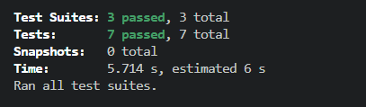

# ✅ Crypto-Creed – Test Cases Summary

This folder contains the **automated Jest + React Testing Library test suite**.  
All tests validate core component behavior, API interactions, and user flows.

---

## ✅ 1. Signup Component Tests (`Signup.test.js`)

### **Type of Testing**
- ✅ Unit Testing (validation, submit handler)
- ✅ Component Testing (form rendering, input handling)

### **Features Covered**

| Test Case | What It Verifies |
|----------|------------------|
| **Form fields render** | Ensures Name, Email, Password, Confirm Password & Sign-Up button appear |
| **Empty submit validation** | Validates required-field checks |
| **Successful signup** | Mocks Firebase signup + verifies submission logic |
| **Firebase mocks** | `createUserWithEmailAndPassword` & Firestore `addDoc` mocked |

### **Key Testing Concepts**
- Mocking Firebase Auth & Firestore
- Mocking CryptoContext
- Custom helper for MUI v4 inputs
- React Testing Library `render`, `fireEvent`, `screen`

---

## ✅ 2. CoinTable Component Tests (`CoinTable.test.js`)

### **Type of Testing**
- ✅ Integration Testing (API + router + context + UI)
- ✅ Component Testing

### **Features Covered**

| Test Case | What It Verifies |
|----------|------------------|
| **Renders title & search bar** | Header and search input visible |
| **Search filter works** | Coin list filters based on text input |
| **Row click navigation** | `history.push()` triggered when clicking a coin row |
| **API mock** | Axios mocked → no live CoinGecko requests |

### **Key Testing Concepts**
- Mocking Axios API calls
- Mocking React Router (`useHistory` / `useNavigate`)
- Mocking CryptoContext
- Mocking News component (to avoid nested API calls)

---

## ✅ 3. News Component Tests (`News.test.js`)

### **Type of Testing**
- ✅ Unit Testing (API mock only)
- ✅ Component Testing

### **Features Covered**

| Test Case | What It Verifies |
|----------|------------------|
| **Loader appears initially** | Shows loading indicator during API fetch |
| **News cards render** | Ensures news items are displayed after the API resolves |

### **Key Testing Concepts**
- Axios mock response
- Async checks using `findBy...()`
- No real network requests

---
## **Test Result**

## ✅ Overall Testing Summary

| Component | Test File | Type |
|----------|-----------|------|
| **Signup** | `Signup.test.js` | Unit + Component |
| **CoinTable** | `CoinTable.test.js` | Integration + Component |
| **News** | `News.test.js` | Unit + Component |

All tests are **fully automated**, isolated, and reliable.
